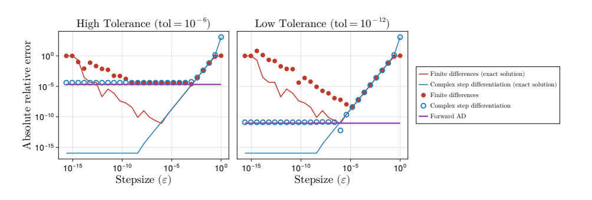

# Programación Diferenciable: Métodos Forward Pt2

**Fecha:** 01/06/2026

:::{iframe} https://www.youtube.com/embed/hlUUiCIZ_mE
:width: 100%
:::

Estas notas prosiguen la temática de {term}`Programación diferenciable` de la clase pasada, retomando la introducción a {term}`Diferenciación automática` (*Automatic Differentation (AD)*).
En particular, comenzamos con una implementación de *AD* en Julia, haciendo uso de los {term}`números duales`.

## Números duales

Se define a los números duales como una extensión de los reales, comenzando por definir a $\epsilon$ número abstracto cumpliendo

$$
\epsilon^{2} = 0\quad ;\quad \epsilon \neq 0 
$$

y escribiendo a todo número dual como 

$$
x_{\epsilon} = x_1 + \epsilon x_2
$$
en donde a $x_1$ será el *valor* de $x_{\epsilon}$ y $x_2$ será su *derivada*.

En lo que a la *AD* respecta, los números duales son una manera muy fácil y directa de implementarla en un lenguaje de programación con herramientas de POO como lo es Julia.

```julia
@ksdef struct DualNumber{F <: AbstractFloat}
            value: F
            derivative: F
end
```
Queremos ser capaces de operar sobre los números duales, sumar, multiplicar, aplicar funciones elementales.
Una de las cosas buenas de Julia es su simplicidad a la hora de extender operaciones a nuevas estructuras de datos.

```julia
#Define operations on dual numbers
function Base.:(+)(a::DualNumber, b::DualNumber)
    res_value = a.value + b.value
    res_derivative = a.derivative + b.derivative
    return DualNumber(res_value, res_derivative)
end

function Base.:(*)(a::DualNumber, b::DualNumber)
    res_value = a.value * b.value
    res_derivative = a.value * b.derivative + a.derivative * b.value 
    return DualNumber(res_value, res_derivative)
end
```
Esto nos va a permitir instanciar los números duales y operar sobre ellos, trasladando siempre en la *parte dual* la derivada correspondiente a la ejecución de las operaciones.

Si creamos 2 números duales:

```julia
a = DualNumber(1.0, 0.0)
b = DualNumber(2.0, 1.0)
```
Y hacemos la operación *a + b* deberia devolver:

```julia
a + b = DualNumber(3.0, 1.0)
```
Analogamente, si creamos 2 números duales:

```julia
a = DualNumber(0.9, 0.0)
b = DualNumber(1.4, 1.0)
```
Y hacemos la operación *a * b* deberia devolver:

```julia
a * b = DualNumber(1.4 * 0.9, 0.9)
```
De esta forma, se puede observar como la parte dual arrastra el valor de la derivada, y esto se puede hacer cuantas veces uno quiera.

Sigamos con uan función un poco más compleja.
```julia
#Define operations on dual numbers
function Base.:(sin)(a::DualNumber)
    res_value = sin(a.value)
    res_derivative = cos(a.value) * a.derivative
    return DualNumber(res_value, res_derivative)
end
```
Como estas funciones, se pueden crear tantas como operaciones tengamos, sin importar que sean unitarias, binarias, etc.

Siempre lo que uno consigue es que la primer componente tenga el *valor* y la segunda componente sea su *derivada*.

Los números duales son muy útiles a la hora de calcular derivadas parciales e incluso direccionales,
debido a que esta estructura permite flexibilizar hacia donde esta derivando uno.

*Ejemplo*<br>
Si hubiesemos querido derivar respecto a b, solo deberiamos haber modificado el input de la siguiente manera:
```julia
a = DualNumber(0.9, 1.0)
b = DualNumber(1.4, 0.0)
a * b = DualNumber(1.4 * 0.9, 1.4)
```
En la práctica uno no crea todas estas funciones desde 0, ya que existe una libreria que contiene todas estas funciones y muchas más.
Uno solo la importa y usa todas las herramientas que provee esta librería.

*Ejemplo*
```julia
using ForwardDiff

x = ForwardDiff.Dual(2.0, 1.0)

y = x^2 + 3x
```

A diferencia de lo que hacíamos en diferencias finitas el valor de la derivada usando *AD* es exacto.

Si probamos esto con diferencias finitas:

La derivada se aproxima mediante

$$
\frac{f(a+\epsilon)-f(a)}{\epsilon}
$$

```julia
f(x) = sin(x * 0.9)

epsilon = 1e-10
@show (f(a.value + ϵ ) - f(a.value)) / ϵ  
```
Mientras que con *AD* el cálculo de la derivada es exacto, con diferencias finitas comienzan a haber errores de truncación debido a
la sensibilidad del resultado con respecto a $\epsilon$.

Una contra de este método es que viene con un costo de memoria más alto, debido a que ahora estamos trabajando no solo con su valor
sino que también con su derivada.

En ecuaciones diferenciales, uno propaga el número dual en el solver númerico y consigue la solución y la derivada de esa solución
con respecto a los parámetros.

Veamos una representación de lo que sucede con cada método:



Se observa que con la *solución exacta de diferencias finitas*, el error baja y luego vuelve a subir debido al error de truncado.

Además, la otra curva refleja la *solución exacta de diferenciacion compleja*, donde se ve que la misma baja hasta $10^{-16}$, el
error de máquina.

Por último, la curva violeta representa el error de *forward AD*. En este caso, se puede observar que el mismo se adapta totalmente
a la tolerancia ya que en ambos gráficos la curva se mantiene constante sobre la tolerancia en cada caso respectivamente.

En resumen, *diferencias fínitas* es el método menos exacto ya que contiene error de truncado, mientras que *diferenciación compleja* baja hasta error de máquina a partir de un cierto $\epsilon$. *Forward AD* no depende de $\epsilon$, por lo que, en caso de que la tolerancia fuese el error de máquina, la curva se mantendría constante en ese valor.

